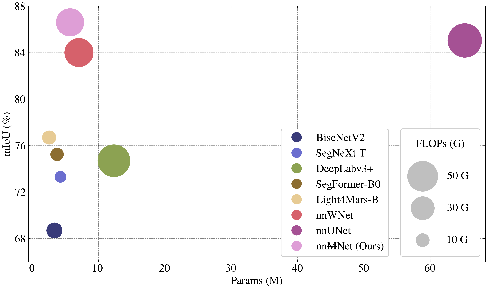

# [nn~~M~~Net: Baseline for Martian Terrain Semantic Segmentation](README.md)

Official PyTorch implementation of nn~~M~~Net.
<!-- Official PyTorch implementation of **nn~~M~~Net**, from the following paper: -->
<!-- [A ConvNet for the 2020s](https://arxiv.org/abs/2201.03545). CVPR 2022.\
[Zhuang Liu](https://liuzhuang13.github.io), [Hanzi Mao](https://hanzimao.me/), [Chao-Yuan Wu](https://chaoyuan.org/), [Christoph Feichtenhofer](https://feichtenhofer.github.io/), [Trevor Darrell](https://people.eecs.berkeley.edu/~trevor/) and [Saining Xie](https://sainingxie.com)\
Facebook AI Research, UC Berkeley\
[[`arXiv`](https://arxiv.org/abs/2201.03545)][[`video`](https://www.youtube.com/watch?v=QzCjXqFnWPE)] -->

<!-- ---  -->

<div align="center">
  
</div>
<p align="center">
  Figure 1: Performance comparison on SynMars-TW.
</p>

We present nn~~M~~Net, a novel hybrid CNN-Transformer model for Martian terrain semantic segmentation.

## Results and Pre-trained Models
### SynMars-TW

|        Name        | Resolution | IoU (%) | Params (M) | FLOPs (G) |  FPS   |   Model   |
| :----------------: | :--------: | :-----: | :--------: | :-------: | :----: | :-------: |
|     nn~~M~~Net     |  512x512   |  86.61  |    5.71    |   39.81   | 63.33  | [model](nnUNet_results/Dataset777_SynMars-TW/nnUNetTrainer_MNet__nnUNetPlans__2d/fold_0/checkpoint_final.pth) |
| nn~~M~~Net&dagger; |  512x512   |  86.12  |    4.23    |   39.32   | 100.27 | [model](nnUNet_results/Dataset777_SynMars-TW/nnUNetTrainer_MNetS__nnUNetPlans__2d/fold_0/checkpoint_final.pth) |

### SynMars-Air

|        Name        | Resolution | IoU (%) | Params (M) | FLOPs (G) |  FPS   |   Model   |
| :----------------: | :--------: | :-----: | :--------: | :-------: | :----: | :-------: |
|     nn~~M~~Net     |  512x512   |  83.25  |    5.71    |   39.81   | 63.33  | [model](nnUNet_results/Dataset778_MarsScapes/nnUNetTrainer_MNet__nnUNetPlans__2d/fold_0/checkpoint_final.pth) |
| nn~~M~~Net&dagger; |  512x512   |  82.95  |    4.23    |   39.32   | 100.27 | [model](nnUNet_results/Dataset778_MarsScapes/nnUNetTrainer_MNetS__nnUNetPlans__2d/fold_0/checkpoint_final.pth) |

### MarsScapes

|        Name        | Resolution | IoU (%) | Params (M) | FLOPs (G) |  FPS   |   Model   |
| :----------------: | :--------: | :-----: | :--------: | :-------: | :----: | :-------: |
|     nn~~M~~Net     |  256x512   |  88.24  |    5.71    |   19.91   | 93.45  | [model](nnUNet_results/Dataset779_SynMars-Air/nnUNetTrainer_MNet__nnUNetPlans__2d/fold_0/checkpoint_final.pth) |
| nn~~M~~Net&dagger; |  256x512   |  88.42  |    4.23    |   19.67   | 178.23 | [model](nnUNet_results/Dataset779_SynMars-Air/nnUNetTrainer_MNetS__nnUNetPlans__2d/fold_0/checkpoint_final.pth) |


## Installation
Install [uv](https://docs.astral.sh/uv/), then install the dependencies:
```
uv sync
```
Next, set the environement variables:
```
export nnUNet_raw="/path/to/nnUNet_raw"
export nnUNet_preprocessed="/path/to/nnUNet_preprocessed"
export nnUNet_results="/path/to/nnUNet_results" 
```
As nnUNet recommended, these should locates under the same directory. 

## Dataset
### nnUNet
Download the [benchmark](README.md), and preprocess all the datasets:  
(The download link is not available now, we will update it soon ;P)
```
./prepare_datasets.sh
```
### MMSegmentation
You can run the script below to convert a preprocessed nnUNet dataset into MMSegmentation format:
```
uv run tools/convert_nnUNet_to_mmseg.py /path/to/nnUNet/dataset /output/directory /path/to/nnUNet/split/file  
```
For example:
```
uv run tools/convert_nnUNet_to_mmseg.py nnUNet_raw/Dataset777_SynMars-TW/ mmseg_datasets/SynMars-TW nnUNet_preprocessed/Dataset777_SynMars-TW/splits_final.json
```

## Training
```
uv run train.py -D 777 nnUNetTrainer_MNet -b 16 # SynMars-TW
uv run train.py -D 778 nnUNetTrainer_MNet -b 32 # MarsScapes
uv run train.py -D 779 nnUNetTrainer_MNet -b 16 # SynMars-Air
```
You can also use vanilla nnUNet command, but the batch size varies according to the available VRAM:
```
nnUNetv2_train 777 2d 0 -tr nnUNetTrainer_MNet
```

## Testing
```
uv run test.py -D 777 nnUNetTrainer_MNet
```
For vanilla nnUNet command:
```
nnUNetv2_predict -i ./nnUNet_raw/Dataset777_SynMars-TW/imagesTs/ -o ./nnUNet_results/Dataset777_SynMars-TW/nnUNetTrainer_MNet__nnUNetPlans__2d/fold_0/prediction -d 777 -c 2d -tr nnUNetTrainer_MNet -f 0
nnUNetv2_evaluate_folder -djfile nnUNet_results/Dataset777_SynMars-TW/nnUNetTrainer_MNet__nnUNetPlans__2d/dataset.json -pfile nnUNet_results/Dataset777_SynMars-TW/nnUNetTrainer_MNet__nnUNetPlans__2d/plans.json nnUNet_raw/Dataset777_SynMars-TW/labelsTs/ nnUNet_results/Dataset777_SynMars-TW/nnUNetTrainer_MNet__nnUNetPlans__2d/fold_0/prediction/
```
To see the results, run:
```
uv run tools/print_model.py nnUNetTrainer_MNet -D 777 -i # validation
uv run tools/print_model.py nnUNetTrainer_MNet -D 777 -i -p # testing
```

## FPS Benchmarking
```
uv run tools/benchmark.py nnUNetTrainer_MNetS --input-shape 512 512
```

## Visualization
Visualize heatmaps of subnetworks:
```
uv run tools/visualize_model.py nnUNetTrainer_WNet -D 777 -I /path/to/image -s
```
Visualize heatmaps of the second encoder and bridge:
```
uv run tools/visualize_model.py nnUNetTrainer_WNet -D 777 -I /path/to/image -H
```


## Acknowledgement
This repository is built using the [nnUNet](https://github.com/MIC-DKFZ/nnUNet), [nn~~W~~Net](https://github.com/Yanfeng-Zhou/nnWNet), and [RALA](https://github.com/qhfan/RALA) repositories. The README is adapted from [ConvNext](https://github.com/facebookresearch/ConvNeXt).

## License
This project is released under the MIT license. Please see the [LICENSE](LICENSE) file for more information.

<!-- ## Citation
If you find this repository helpful, please consider citing:
```
@Article{liu2022convnet,
  author  = {Zhuang Liu and Hanzi Mao and Chao-Yuan Wu and Christoph Feichtenhofer and Trevor Darrell and Saining Xie},
  title   = {A ConvNet for the 2020s},
  journal = {Proceedings of the IEEE/CVF Conference on Computer Vision and Pattern Recognition (CVPR)},
  year    = {2022},
}
``` -->